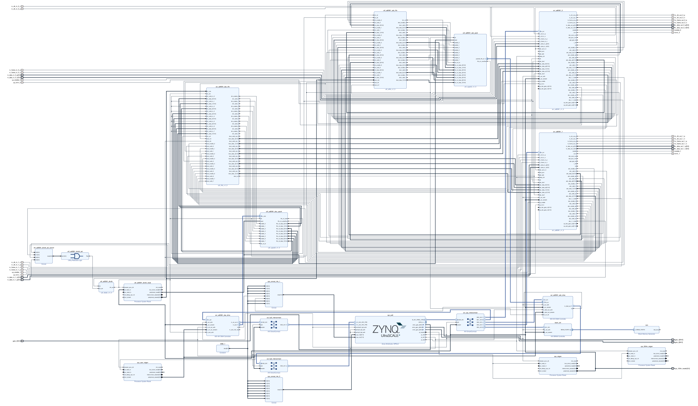

# hdl-fmcomms5

This repository is designed to be an OOT module to use in conjunction with [hdl-rwt](https://github.com/redwiretechnologies/hdl-rwt/tree/main).
It adds support for the FMCOMMS5 project provided by Analog Devices.  

For issues with this repository, its documentation, or additional questions, please reach out to our lead FPGA engineer, Jonathan Ambrose, at (jambrose@redwiretechnologies.us).

---

# Requirements

This repository needs the requirements listed in the [hdl-rwt](https://github.com/redwiretechnologies/hdl-rwt/tree/main) README.    

---

# Building

Please note that this repository only implements the personality, but it does not provide build targets as the Oxygen SDR does not support it.
To add build targets, please additionally use either [hdl-compat-fmcomms5-zcu102](https://github.com/redwiretechnologies/hdl-compat-fmcomms5-zcu102) or [hdl-compat-fmcomms5-carbon](https://github.com/redwiretechnologies/hdl-compat-fmcomms5-carbon).   
 
To use this repository in conjunction with [hdl-rwt](https://github.com/redwiretechnologies/hdl-rwt/tree/main), this repository must be checked out into the `oot` directory as shown below:
```
$ ls oot

hdl-fmcomms5/
``` 

After having done this, you must run `scripts/link_oot.sh` from the [hdl-rwt](https://github.com/redwiretechnologies/hdl-rwt/tree/main) repository. This will create hard symlinks from the files in your OOT modules to the directory structure within [hdl-rwt](https://github.com/redwiretechnologies/hdl-rwt/tree/main).   

# Personalities

For clarification's sake on the nomenclature, a "personality" is a generic block diagram configuration that can/will be customized on a per board basis. A "project" is the single customized Vivado project for a combination of personality and board. 
 
## `fmcomms5`

The `fmcomms5` personality implements the FMCOMMS5 project provided by Analog Devices. 

### Block Diagram


This block diagram uses the Carbon SDR as the intended platform.   

<center>


[](images/bd/fmcomms5.jpg)


</center>
